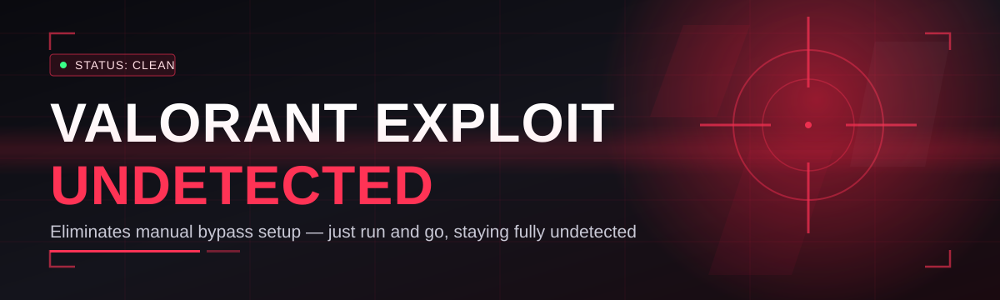
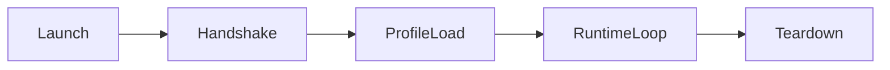

# valorant-script-hub 🎯🛰️

  

*A Valorant enhancement layer built for people who'd rather read patch notes than get flanked by them.*

## 🧬 Overview

I started `valorant-script-hub` because I got tired of alt-tabbing to seventeen different Discord servers just to find a tool that didn't get flagged, didn't get abandoned after one patch, and didn't come bundled with three browser toolbars I never asked for. This repo is the result of consolidating that chaos into one maintained, versioned, actually-documented project. It's a toolkit for players who want to understand and adjust their Valorant client behavior at a deeper layer than the settings menu allows — think of it as the difference between adjusting your TV's brightness and actually recalibrating the panel.

`valorant-script-hub` sits in the "Valorant Exploit Undetected" space, but with an emphasis on the *undetected* half of that phrase — meaning engineering discipline around signature footprints, update cadence, and community-verified stability matters more here than flashy feature counts. We track Riot Vanguard's behavior patch-by-patch, and every module ships only after internal soak-testing against the current client build.

This is for the tinkerer, the competitive grinder chasing marginal edges, and the curious systems nerd who wants to peek behind the curtain of how modern anti-cheat actually watches a game client. It is not for people expecting a magic rank-up button — that's not how any of this works, and if someone tells you otherwise, they're selling you something.

  

> [!NOTE]
> The landing page above is the only official distribution point. Anything claiming to be `valorant-script-hub` outside of it is not us, and probably isn't safe.

---

## 🧠 What's Actually Inside

Capabilities laid out plainly — no vague marketing fluff, just what the modules do.

| Capability | What It Actually Does |
|---|---|
| **Signature Rotation Engine** | Automatically cycles internal identifiers on each launch so the module's footprint never sits still long enough to become a static fingerprint. |
| **Vanguard-Aware Scheduler** | Watches for Vanguard driver activity and defers sensitive operations until the client is in a safe idle window. |
| **Config Profiles** | Save distinct loadouts of settings per game mode — Ranked, Unrated, Deathmatch — and swap between them with one click. |
| **Live Telemetry Overlay** | An in-client HUD panel showing real-time module status, latency to Riot's servers, and current session uptime. |
| **One-Click Safe Mode** | Instantly disables every active module and reverts the client to stock behavior — useful before tournament play or a fresh patch. |
| **Auto-Update Pulse** | Checks build compatibility against the latest Valorant patch on launch, before any module actually loads. |
| **Community Recipe Sharing** | Import/export config files so the community can share tuned setups without touching source code. |
| **Crash-Safe Watchdog** | Detects unexpected client termination and cleanly rolls back state so nothing is left half-loaded. |

> [!TIP]
> New here? Start with **Safe Mode** enabled by default on first launch. Get a feel for the interface before flipping on the heavier modules.

---

## 🚀 Getting In The Door

1. Head to the [landing page](https://SymbolAnalyst.github.io/valorant-script-hub/) using the download button above — it's the single source of truth for builds.
2. Grab the latest `.exe`, run it, and let it self-verify against your current Valorant client version.
3. Launch Valorant *first*, then launch `valorant-script-hub` — order matters, the scheduler needs an active game process to hook its telemetry into.
4. Configure your profile, hit **Activate**, and you're live. Alt+Home toggles the overlay if you want it out of view during a clutch round.

> [!IMPORTANT]
> Always launch Valorant before the tool, never after. Reversing that order is the #1 cause of "it's not detecting my game" support tickets.

---

## 🖥️ System Requirements

- **OS:** Windows 10 (21H2+) or Windows 11 — no Linux/macOS support, Vanguard doesn't run there anyway
- **Architecture:** x64 only
- **Dependencies:** none — it's a standalone `.exe`, no runtime installs, no package managers
- **Disk:** ~180MB free space
- **Permissions:** Administrator privileges required (Vanguard runs at kernel level, so we have to meet it there)
- **.NET / VC++ Redist:** bundled internally, nothing to fetch separately

---

## ⚙️ How It Works

The short version: the tool sits between your input layer and the game process, translates configuration into runtime behavior, and constantly checks itself against Vanguard's current heartbeat pattern before doing anything risky.

1. **Launch detection** — the tool waits for `VALORANT-Win64-Shipping.exe` to appear in the process list.
2. **Handshake** — a lightweight compatibility check confirms the current build hash is supported.
3. **Profile load** — your saved config (Ranked/Unrated/etc.) is parsed and applied.
4. **Runtime loop** — modules run their cycle, rotating signatures and monitoring Vanguard activity continuously.
5. **Session teardown** — on game exit, everything unwinds cleanly, leaving no orphaned state behind.

---

## 🩹 Troubleshooting

<strong>The overlay won't show up in-game.</strong>

Make sure Valorant is running in **Fullscreen Borderless** or **Windowed** mode — true Exclusive Fullscreen blocks overlay rendering on most tools, not just ours.

<strong>It flagged my build as "unsupported."</strong>

Riot ships patches faster than any of us would like. Check the landing page — if there's no update yet, hang tight, we usually push compatibility fixes within 24-48 hours of a client patch.

<strong>Windows Defender is yelling at me.</strong>

Expected. Kernel-adjacent tools that aren't Microsoft-signed will always trip heuristic flags. Add an exclusion for the install folder if you trust the source (which, again, should only ever be the official landing page).

<strong>Config profiles disappeared after an update.</strong>

Profiles live in `%APPDATA%/valorant-script-hub/profiles/` and should persist across updates. If they vanished, check if antivirus quarantined the folder — this happens occasionally with aggressive AV suites.

<strong>Can I run this alongside other overlay tools like Discord or OBS?</strong>

Generally yes. Discord's overlay and OBS's game capture coexist fine. Conflicts are rare but usually resolve by reordering overlay hook priority in Settings > Compatibility.

> [!WARNING]
> Never disable Vanguard itself to "fix" a detection issue. That's not troubleshooting, that's just asking for a ban letter.

---

## 🎨 UI, UX & The Little Things

The interface follows a "dashboard, not a control panel" philosophy — dark by default, information-dense but never cluttered.

- **Themes:** Midnight (default), Slate, and a high-contrast Colorblind-Safe mode
- **Shortcuts:**
  - `Alt + Home` — toggle overlay visibility
  - `Alt + End` — panic button, instantly triggers Safe Mode
  - `Ctrl + S` — save current profile
  - `F1` — open in-app quick help
- **Settings persistence:** everything autosaves locally, no cloud account required
- **Notification style:** subtle toast alerts in the corner, never a modal that blocks your view mid-round

---

## 🤝 Contributing & Community

We treat this like a real project, not a Discord server with a GitHub afterthought.

> [!TIP]
> Good first contributions: UI theme tweaks, documentation fixes, and localization strings. Check open issues tagged `good-first-issue`.

- Open an issue before a big pull request — saves everyone time
- Follow the existing code style; consistency beats cleverness
- Discussions tab is for feature requests, bug reports go in Issues
- Be excellent to each other — we moderate the community with a light hand until we don't have to

---

## 📄 License

Released under the [MIT License](LICENSE), 2026. Do what you want with it, just don't pretend you wrote it from scratch.

---

## ⚖️ Disclaimer

`valorant-script-hub` is provided for educational and research purposes around game client architecture and anti-cheat behavior. Modifying a live multiplayer client carries inherent risk, including account action from the publisher, and usage is entirely at your own discretion. This project is not affiliated with, endorsed by, or connected to Riot Games in any capacity. Riot Games and Valorant are trademarks of Riot Games, Inc.

  

